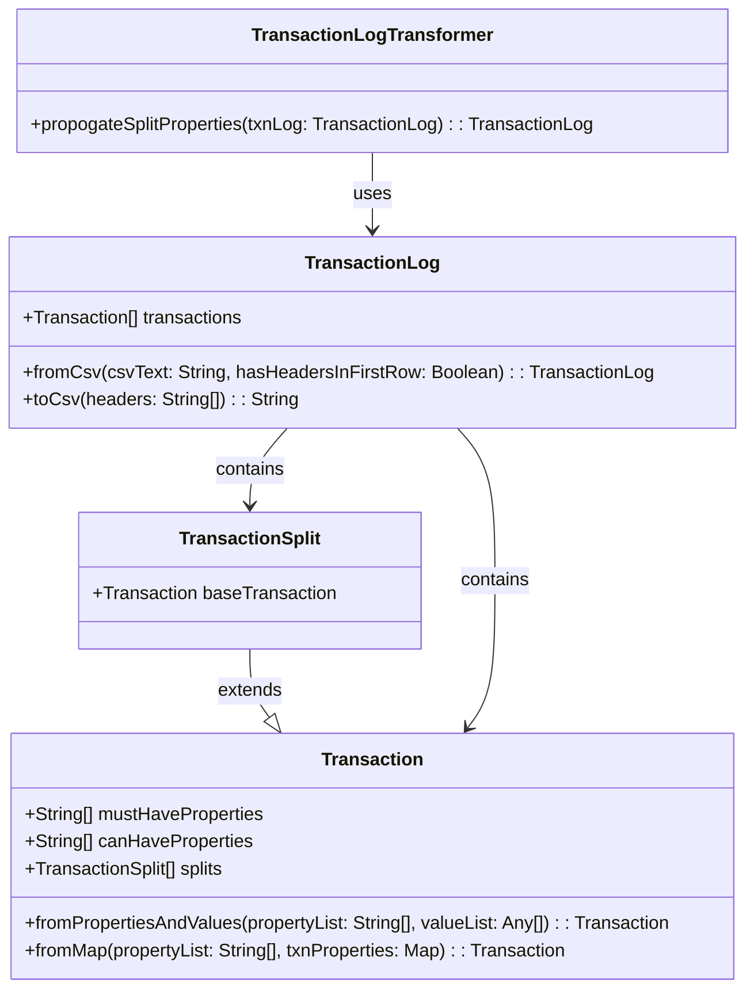

# 4C

## Context
System
Actors - Users of other systems
Interactions - High level communication and interaction

## Containers
Containers - Deployable units
Relationships - How they interact

## Components
Components - Parts of container (e.g. class, service, module)
Interactions - 

## Code
Classes and Methods - Implementation details
Relationships

## Class specification

### `Transaction` Class
- HAS-A property **mustHaveProperties**, which is an ordered list of strings (e.g., "postedOn", "payee", "amount", "account") - required properties for transaction validity.
- HAS-A property **canHaveProperties**, which is an ordered list of strings (e.g., "tag", "note") - optional properties that enhance transaction details.
- HAS-A property **splits**, which is a list of `TransactionSplit` objects - allows for the division of transactions into multiple parts.
- IMPLEMENTS **fromPropertiesAndValues(propertyList: string[], valueList: any[])** - creates a transaction instance from lists of properties and their corresponding values.
- IMPLEMENTS **fromMap(propertyList: string[], txnProperties: { [key: string]: any })** - constructs a transaction from a key-value map.

### `TransactionSplit` Class
- HAS-A **baseTransaction** - references the base transaction for split transactions.
- EXTENDS **Transaction** - inherits properties and methods from the `Transaction` class.

### `TransactionLog` Class
- HAS-A ordered list of **Transaction** - maintains a record of all transactions.
- IS iterable - supports iteration over the transaction list.
- IMPLEMENTS **fromCsv(csvText: string, hasHeadersInFirstRow: boolean)** - imports transactions from a CSV format.
- IMPLEMENTS **toCsv(headers: string[])** - exports the transaction log to CSV format, optionally including specified headers.

## Class diagram description (Mermaid)

## Class diagram

https://www.mermaidchart.com/app/projects/aa3787ab-200f-40f6-9f3c-d864d9752ad5/diagrams/17fcbbc5-2ab6-4b21-9d3f-0057dee7131e/version/v0.1/edit
